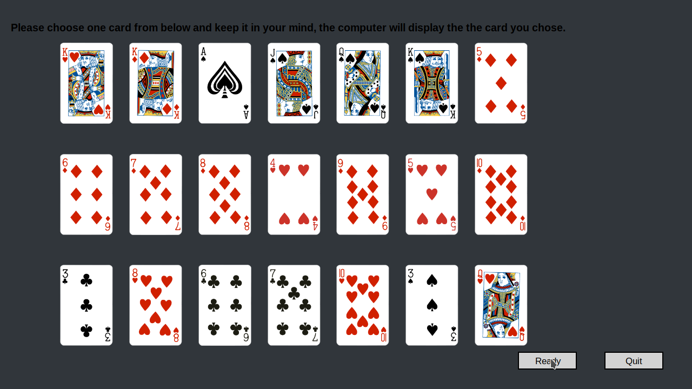
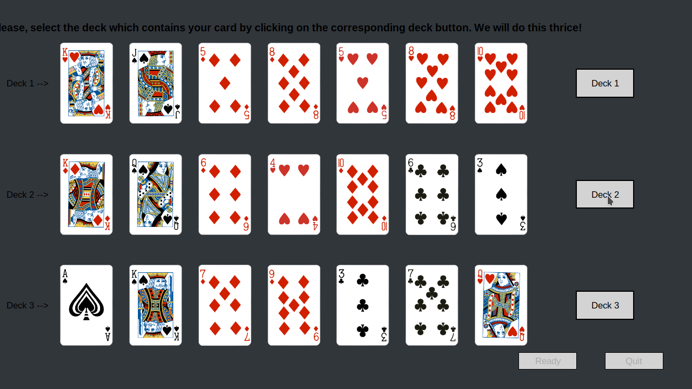
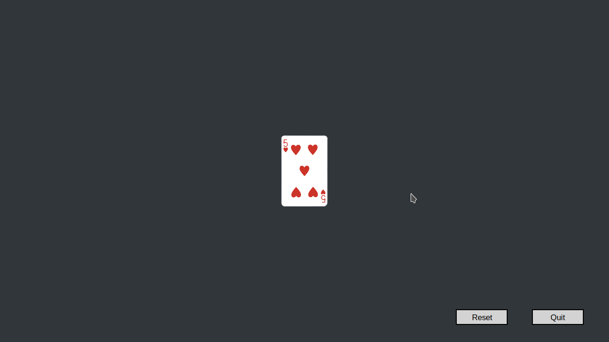

# Card Guessing Game

> This program displays different cards on the screen and then guessed the card that user selected.






## Written in

Python 

- Code is encapsulated
- Object oriented design with the help of classes and methods
- Use of graphics library that uses tkinter
- Use of PNG images to display the cards

## Getting Started

Open the terminal

Step 1.
```
git clone https://github.com/smcommits/cardGame
```
Step 2.
```
cd cardGame
```
Step 3.
```
python3 main.py
```


## Authors

👤 **Anas Siddiqui**

- GitHub: [Anas Siddiqui](https://github.com/smcommits)


## 🤝 Contributing

Contributions, issues, and feature requests are welcome!

Feel free to check the [issues page](issues/).

## Show your support

Give a ⭐️ if you like this project!

## Acknowledgments

- The [Graphics Library](./graphics.py) used in the project is provided in the book _PYTHON PROGRAMMING: AN INTRODUCTION TO COMPUTER SCIENCE, 3RD ED_ by John Zelle. 

